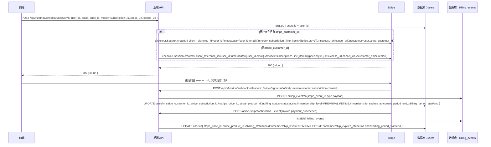
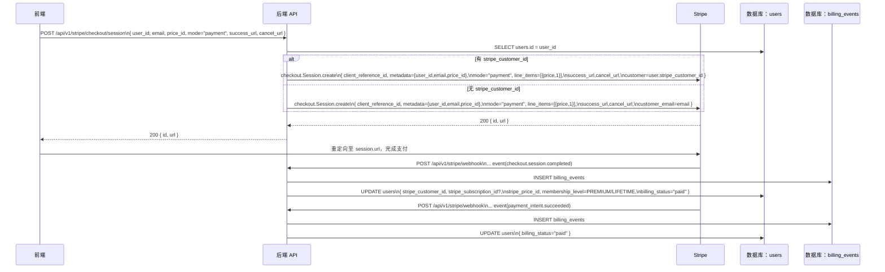

toolName: todo_write
            
status: success
          
Todos updated: 1 items
          
**流程图：订阅模式**
- 说明：展示从创建 Checkout Session 到订阅生效的交互与字段

**流程图：一次性支付模式**
- 说明：一次性支付完成后计费成功与用户状态更新

**交互内容（字段标注）**
- 创建 Checkout Session 请求体
  - user_id、email、price_id、mode、success_url、cancel_url
- Stripe Session 创建参数
  - client_reference_id=user_id
  - metadata={user_id, email, price_id}
  - mode="subscription"|"payment"
  - line_items=[{price: price_id, quantity: 1}]
  - success_url、cancel_url
  - customer 或 customer_email（二者择一）
- Webhook 请求
  - Headers: Stripe-Signature
  - Body: event JSON（类型如 checkout.session.completed、customer.subscription.created、invoice.payment_succeeded、payment_intent.succeeded 等）
- 数据库更新（users 表）
  - 订阅：stripe_customer_id、stripe_subscription_id、stripe_price_id、stripe_product_id
  - 会员：membership_level（FREE/PREMIUM/LIFETIME）、membership_expires_at
  - 账单：billing_status（active/paid/payment_failed/canceled）、billing_period_start、billing_period_end
- 事件审计（billing_events 表）
  - stripe_event_id、event_type、payload、processed、timestamps

**关键差异点**
- 绑定客户 vs 预填邮箱
  - 有 user.stripe_customer_id → 传 customer
  - 无 → 传 customer_email=email
- 会员映射
  - 通过 price_id 是否在 allowed_price_ids 白名单中决定是否设为 PREMIUM/LIFETIME
- 失败与取消
  - invoice.payment_failed → billing_status="payment_failed"
  - subscription.deleted → membership_level=FREE，billing_status="canceled"
  - 前端 cancel_url 返回由前端决定 UI 状态

**代码参考**
- 路由与 Handler
  - Webhook 路由 [stripe.py](file:///Users/brizenchi/Project/water/watermarkremover_backend/app/api/v1/routers/stripe.py#L17-L39)
  - 创建 Session 路由 [stripe.py](file:///Users/brizenchi/Project/water/watermarkremover_backend/app/api/v1/routers/stripe.py#L41-L51)
  - Handler 方法 [stripe_handler.py](file:///Users/brizenchi/Project/water/watermarkremover_backend/app/api/v1/handler/stripe_handler.py#L24-L34)
- 服务层
  - 创建 Session [stripe_service.py:create_checkout_session](file:///Users/brizenchi/Project/water/watermarkremover_backend/src/services/stripe_service.py#L99-L160)
  - 事件分发与处理 [stripe_service.py:_handle_business_logic](file:///Users/brizenchi/Project/water/watermarkremover_backend/src/services/stripe_service.py#L74-L96)
  - 关键事件处理：
    - checkout.session.completed [链接](file:///Users/brizenchi/Project/water/watermarkremover_backend/src/services/stripe_service.py#L132-L161)
    - invoice.payment_succeeded [链接](file:///Users/brizenchi/Project/water/watermarkremover_backend/src/services/stripe_service.py#L163-L209)
    - invoice.payment_failed [链接](file:///Users/brizenchi/Project/water/watermarkremover_backend/src/services/stripe_service.py#L211-L229)
    - subscription.created/updated/deleted [链接1](file:///Users/brizenchi/Project/water/watermarkremover_backend/src/services/stripe_service.py#L231-L265) [链接2](file:///Users/brizenchi/Project/water/watermarkremover_backend/src/services/stripe_service.py#L267-L301) [链接3](file:///Users/brizenchi/Project/water/watermarkremover_backend/src/services/stripe_service.py#L303-L323)
- 数据库
  - 用户模型与更新 [user.py](file:///Users/brizenchi/Project/water/watermarkremover_backend/src/models/user.py#L64-L80) 与 [update](file:///Users/brizenchi/Project/water/watermarkremover_backend/src/models/user.py#L215-L276)
  - 事件审计模型 [billing_event.py](file:///Users/brizenchi/Project/water/watermarkremover_backend/src/models/billing_event.py)

**补充建议**
- 将创建 Session 接口改为需登录态时，可在 Handler 从当前用户填充 user_id、email，避免前端传递敏感标识
- 配置产品 ID 映射到 PRO 通过环境变量维护，便于后续扩展与多产品支持

我已生成并标注了两种模式的完整交互流程图。如需我导出为 PNG/SVG 或整合到你们的文档系统，我可以继续处理。